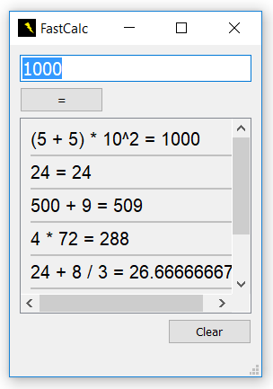

# FastCalc
A fast and simple calculator for Windows.

The program is made with Qt Creator. It uses [TinyExpr](https://github.com/codeplea/tinyexpr) library to parse the user input and show the answer.

## Manual

Feel free to download the [installer](FastCalc_setup_1.4.exe) to test and use FastCalc.

Just type your calculation and press Enter or "=" button to calculate it. You can browse old calculations with up and down arrow keys or just by clicking on them.

Press CTRL + D to clear the memory.
